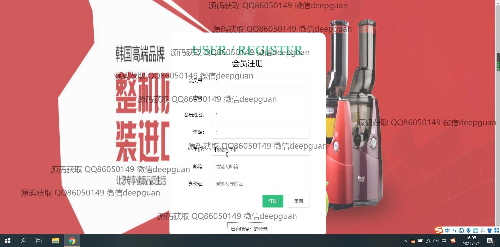

<h1 align="center">旅游景点线路网站</h1>

## 简介
旅游景点线路网站：角色分为管理员、用户；功能包括个人中心、会员管理、景点分类管理、旅游景点管理、旅游线路管理和系统管理，提供信息查看、编辑和评价功能。整体设计简洁明了，用户体验良好。    --计算机毕业设计源码；毕设源码；java毕业设计源码

## 联系方式

<h3 align="center">获取完整代码与数据库文件 + 微信：deepguan QQ: 86050149 QQ群: 783742310</h3>

<h3 align="center">可帮忙远程部署 包运行成功！提供远程部署、修改代码、设计文档指导、代码讲解等服务！</h3>

## 功能介绍（完整见运行截图）
管理员：  
基本功能：登录、注册、退出、权限管理。  
会员管理：新增、查看、修改、删除会员信息，包括姓名、性别、年龄、联系方式和身份证号。  
旅游景点管理：管理景点信息，如名称、星级、地址、营业时间、门票价格、注意事项及介绍，支持图片上传与编辑。  
旅游线路管理：新增、修改、删除旅游线路，包含线路名称、景点信息、起点、途经路段、终点和交通方式，提供批量删除功能。  
系统管理：调整系统设置，查看日志信息，管理权限及其他后台功能模块。  

用户：  
基本功能：登录、注册、退出，访问用户专属页面。  
旅游景点：浏览景点信息，包括名称、星级、地址、营业时间等，支持景点搜索与评价功能。  
旅游线路：查看线路详情，包括起点、途经路段、终点及交通方式，支持筛选和线路评价。  
个人中心：管理个人信息，如修改密码、更新头像，查看我的收藏及历史评价。

## 运行截图

本代码来源于网络,仅供学习参考使用!

